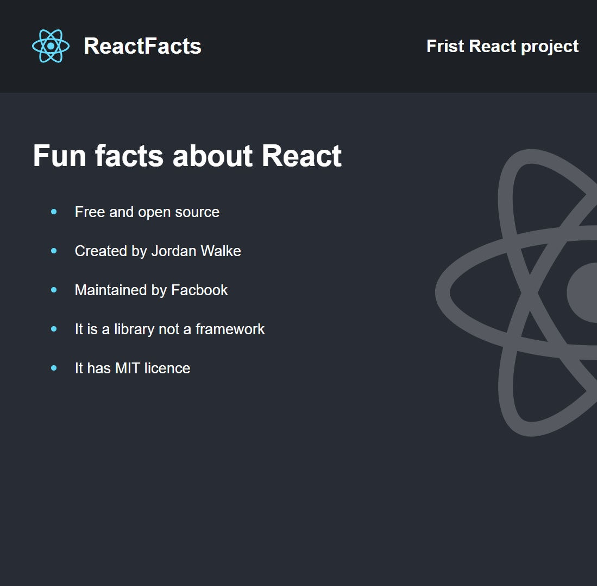

# Project One - Hello World

This project is a simple static website that uses React to display a hello world message. It is a simple project to get familiar with React and to understand how to use it to create a simple website.

## `public/index.html`

This is the main html file that is used to display the website. It is a simple html file that has a `div` with an `id` of `root`. This is where the react app will be rendered. aka the entry point of the react app.

Also beside `index.html` there is a `favicon.ico` file that is used to display the icon of the website.

## `src/`

As the name suggests this is where the source code of the react app is located. It contains the `index.js` file which is the entry point of the react app.

It also contains the `App.js` file which is the main component of the react app. It is the component that is rendered in the `index.js` file.

The `App.js` file returns other components that are located in the same folder. These components are the `Header.js`, `MainContent.js` and `BackgroundImage.js` components. These components are used to display the header and footer of the website.

My hello world react project

